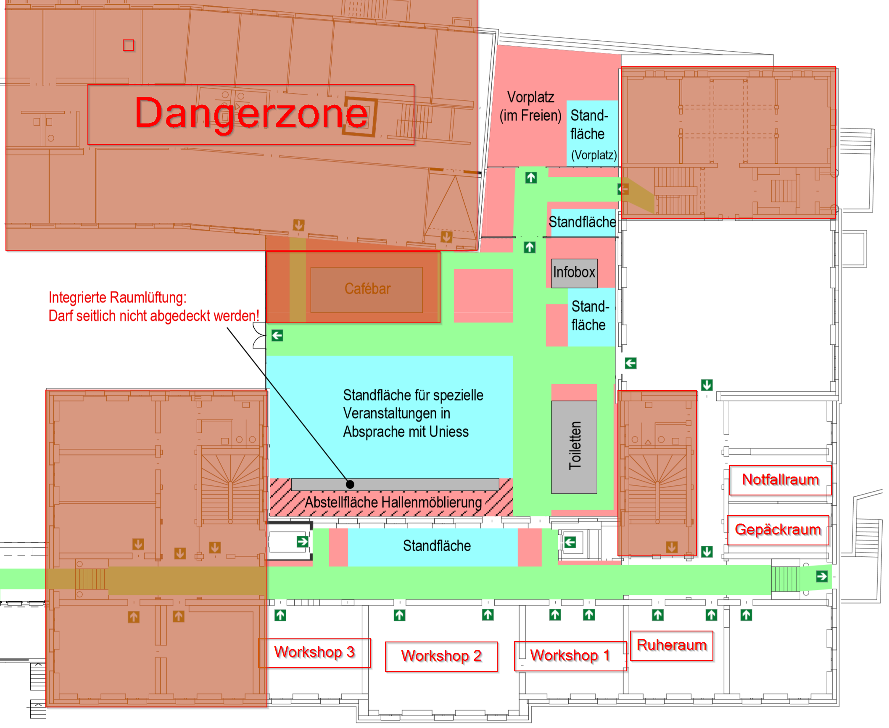

title: Kickoff
class: animation-fade
layout: true

<!-- This slide will serve as the base layout for all your slides -->
.bottom-bar[
  {{title}}
]

---

class: impact

# {{title}}

---

# Willkommen

[unihack.ch/live](/live)

---

# Ablauf

* 19:00 Pizza
* 19:45 Teambildung und Pycharm installieren 
* 20:00 Workshops
* 24:00 Midnight Snack
* 08:00 Zmorge
* 16:00 Abschlusspräsentationen mit anschliessendem Apéro

---

# Challenges

## Roboter mit Line Tracking und Ultraschall

## Roboter mit Webcam

---

#Teambildung

* 19:45 - 20:00: Annnounce am Checkin Desk
* Teamleader holt Hardware ab
* Announce your Team 
* **bis 20:00 Pycharm installiert**

---

#Workshops

* Python for Beginners
* Web for Beginners
* Intro Bots Sonic
* Intro Bots Vision

---

# Raumplan

---

# Ablauf

| Zeit  | Workshop 1               | Workshop 2           | Workshop 3            |
|-------|--------------------------|----------------------|-----------------------|
| 20:00 | Python for Beginners 45' | Intro Bots Sonic 30' | Intro Bots Vision 30' |
| 20:45 |                          |                      |                       |
| 21:00 | Intro Bots Sonic 30'     |   |  |
| 21:40 | Web for Beginners 30'                        |    |  |

---

# Infos & Regeln

* Aussentüren über Nacht geschlossen
* Essen nur im Bistroareal
* Fluchtwege freihalten
* Rauchen beim Bistroausgang
* Für Notfälle ist Verbandszeug vorhanden.

---

# Sponsoren

